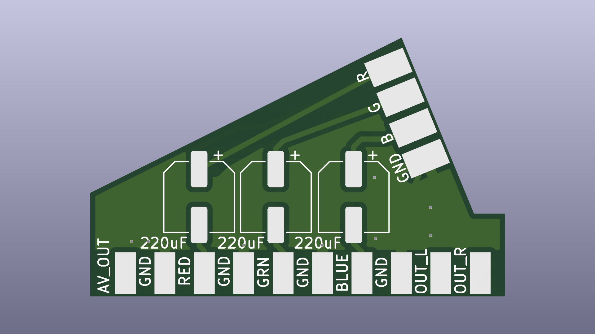
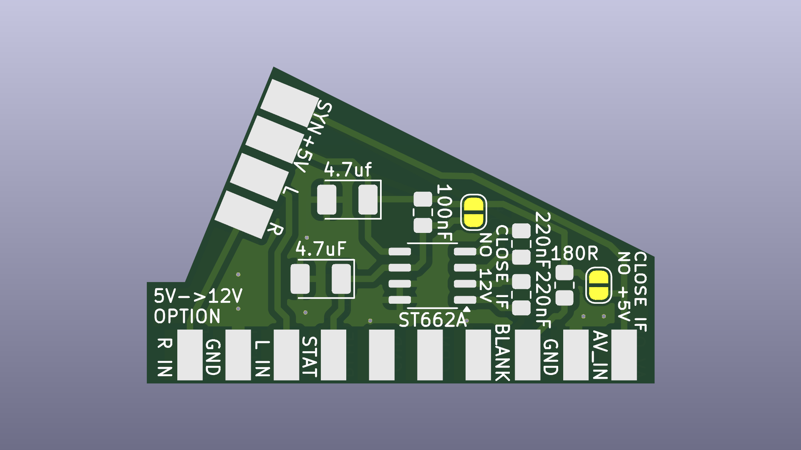
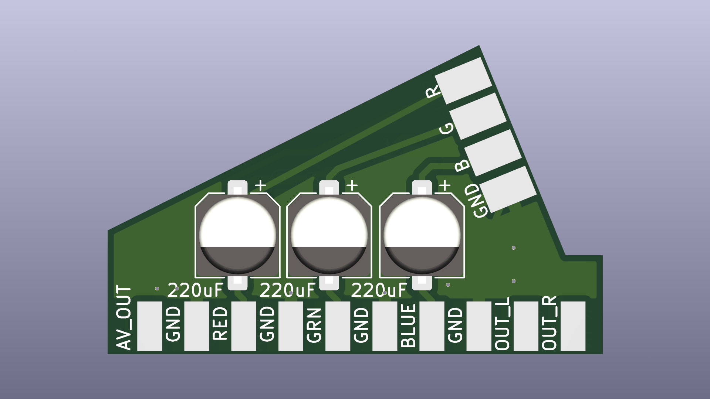
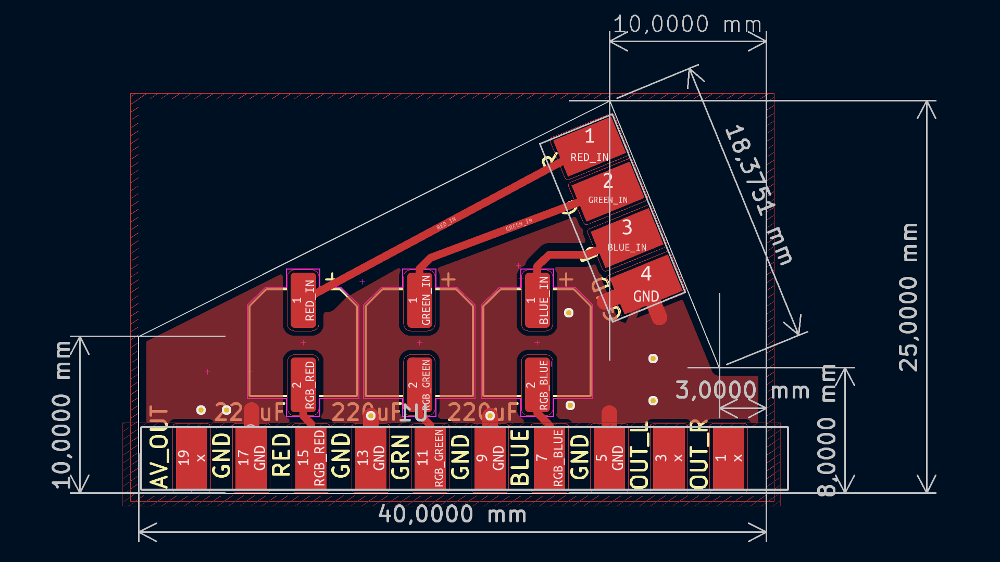

# SCART RGB Cable Breakout
SCART RGB cable breakout PCB with ST662A 5V->12V converter option for automatic SCART 4:3 aspect ratio switching.

* Intended to use with common cheap plastic SCART male connectors
* Option to bypass RGB signals capacitors with solder jumpers (if your RGB source device already have them)
* Option to use separate +5V line or composite sync signal as SCART fast switch/blanking voltage source with solder jumper
* Optional 5V->12V ST662A converter for automatic 4:3 aspect ratio switch
* No sync stripper / separator option

## Order boards from manufacturer
Send "gerbers" folder content packed to zip archive.

## Build Notes
Be aware when ordering SMD capacitors: they should be minimal height 3.9 ~ 4.5 mm, depending on specific SCAT connector. Or use A,B,C size tantalum capacitors.

180 Ohms resistor always should be soldered.

Bridge solder jumper if no separate +5V line supplied (composite sync / composite video signal used as power source for RGB selection / Status & Aspect Ratio pins). 
Bridge solder jumper if no 5V->12V converter option installed (connect power to Status & Aspect Ratio pins).

Cable intended to be fixed inside connector housing with nylon strap.