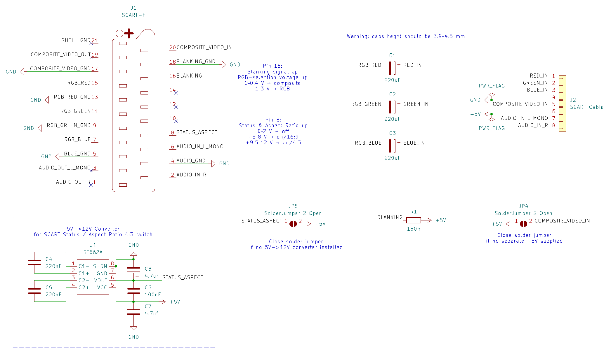

# SCART RGB Cable Breakout
SCART RGB cable breakout PCB with ST662A 5V->12V converter option for automatic SCART 4:3 aspect ratio switching.

* Intended to use with common cheap plastic SCART male connectors
* Option to bypass RGB signals capacitors with solder jumpers (if your RGB source device already have them)
* Option to use separate +5V line or composite sync signal as SCART fast switch/blanking voltage source with solder jumper
* Optional 5V->12V ST662A converter for automatic 4:3 aspect ratio switch
* No sync stripper / separator option

## SCART Function Switching and Blanking
Reference from:
[fruitcake.plus.com/Sinclair/Spectrum128/SCARTCable](http://www.fruitcake.plus.com/Sinclair/Spectrum128/SCARTCable/Spectrum128SCARTCable3.htm)

|Pin|Signal|Level|
|-----|-----|-----|
|8|Function Switching|0 to 2V = TV (default option if pin unconnected). 5 to 8V = TV wide screen. 9.5 to 12V = AV mode. >10k input impedance [When an AV source becomes active it sets 12V on pin 8 and causes the TV to automatically switch to that SCART input. When the source stops, the signal returns to 0V and TV viewing is resumed. If a 16:9 program is present, the source raises the signal on pin 8 to only 5V.]|
|16|Blanking|75 ohm input and output impedance. 0V to 0.4V: TV is driven by the composite video input signal on pin 20, with transparent overlay of the Red, Green and Blue signals (default option if pin unconnected). 1V to 3V: TV is driven by the Red, Green, Blue signals and composite sync signal on pin 20.|
|20|Video Input (Luminance Input)|1V [sync 0V - 0.3V, data 0.3V - 1V], 75 ohm input impedance (1V including sync, 75 ohm output impedance)|

The FUNCTION SWITCHING signal (pin 8) is used to instruct the TV set to automatically switch to show the SCART input, and the BLANKING signal (pin 16) is used to inform the TV set whether to show a composite video or RGB signal from that SCART socket. If the BLANKING signal is left disconnected then composite video is the default AV input type. If the FUNCTION SWITCHING signal is left disconnected then the AV input must be selected manually. The table below shows the different permutations: 

|FUNCTION SWITCHING (Pin 8) 	|BLANKING (Pin 16) 	|TV Mode|
|-----|-----|-----|
|0V - 2V	|0V - 0.4V	|Composite Video, Manual Selection|
|0V - 2V	|1V - 3V	|RGB, Manual Selection|
|9.5V - 12V	|0V - 0.4V	|Composite Video, Automatic Selection|
|9.5V - 12V	|1V - 3V	|RGB, Automatic Selection|

## Order boards from manufacturer
Send "gerbers" folder content packed to zip archive.

## Build Notes
Be aware when ordering SMD capacitors: they should be minimal height 3.9 ~ 4.5 mm, depending on specific SCAT connector. Or use A,B,C size tantalum capacitors.

180 Ohms resistor always should be soldered.

Bridge solder jumper if no separate +5V line supplied (composite sync / composite video signal used as power source for RGB selection / Status & Aspect Ratio pins). 
Bridge solder jumper if no 5V->12V converter option installed (connect power to Status & Aspect Ratio pins).

Cable intended to be fixed inside connector housing with nylon strap.